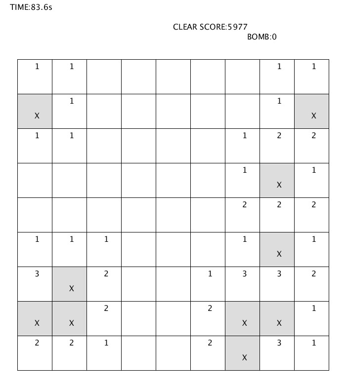

# Simple Minesweeper
Language: Proessing  

Simple Minesweeper

## 操作方法

左クリックで今マウスカーソルがある位置のマスを開ける
右クリック1回でマスに爆弾があるとフラグを付ける
右クリック2回でマスに爆弾があるかどうかわからないというマーキング
右クリック3回でマスのマーキングを解除

Rで新規ゲーム

数字の1またはeでイージーモード　（9x9　爆弾10個）
数字の2またはnでノーマルモード　（16x16　爆弾40個）
数字の3またはhでハードモード　　（16x30　爆弾99個）

Pキーで　スクリーンショット